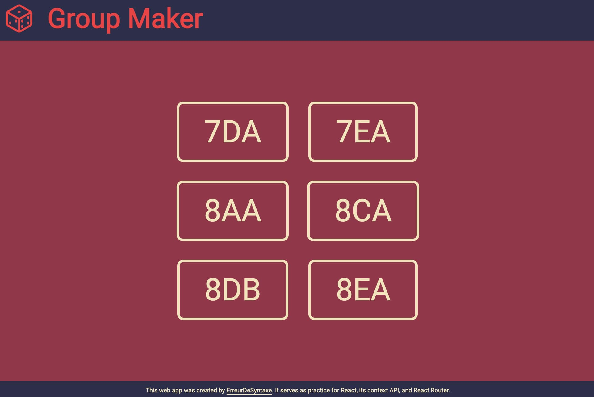

# Group Maker

A web app for teachers to quickly generate random student groups in class.  
Originally built in Vanilla JS, now rebuilt with React for a smoother, interactive experience.

## About the Project

### Preview



### Live

[Group Maker](https://erreurdesyntaxe.github.io/group-maker/ 'live project')

### Objective

Quickly create random student groups for class presentations or teamwork.  
Teachers can select a class, choose group sizes, visualize groups, and temporarily remove absentees.

### Key Features

- Select a class and group size (1–4 students)
- Visualize the randomly generated groups
- Remove and re-add students to the grouping pool
- Reset absentee list at each lesson
- Regenerate groups on demand
- Responsive design for all devices

## Built With


## To-Do

- [x] Understand the objectives
- [x] Plan
  - [x] User stories
  - [x] Features
  - [x] Flowchart
  - [x] Architecture
  - [x] UI Design
  - [x] Responsive Design
- [x] Development
  - [x] Basic HTML
  - [x] Name Lists
    - [x] Teachers
    - [x] Teachers' Classes
  - [x] Console-Based Logic
  - [x] Remove Inidividual Students
  - [x] UI Features
    - [x] UI Sketch
    - [x] Overall Layout
    - [x] Individual Section Layout
  - [x] Responsive Design

## User Stories

- As a teacher, I want to select the class I teach.
- As a teacher, I want to choose the group size.
- As a teacher, I want to see a visual representation of groups.
- As a teacher, I want to remove or re-add absentees.
- As a teacher, I want the absentee list reset each lesson.
- As a teacher, I want a back button to undo misclicks.

## Flowchart

Page Loads
↓
“Which class are you teaching?”
↓
Remove / Re-add students (optional)
↓
Shuffle Button Pressed
↓
Groups randomly generated & displayed

## Architecture

```javascript
class Group {
  constructor(number, nameList) {
    this.number = number;
    this.nameList = nameList;
  }
}

class Teacher {
  constructor(name, groups) {
    this.name = name;
    this.groups = groups;
  }
}

class App {
  constructor() {
    this.init();
  }

  init() {
    // Initialization logic here
  }
}

(React Component Hierarchy)

- App
  - Header
  - Footer
  - Homepage
  - Generator
    - NameList
      - ListItem
    - Teams
      - Team
```

## Lessons & Difficulties

- Using GitHub Pages with Vite requires careful handling of base paths and routing.
- React Context API simplifies state management for student lists.
- Preplanning folder structure and assets saves time during refactoring.
