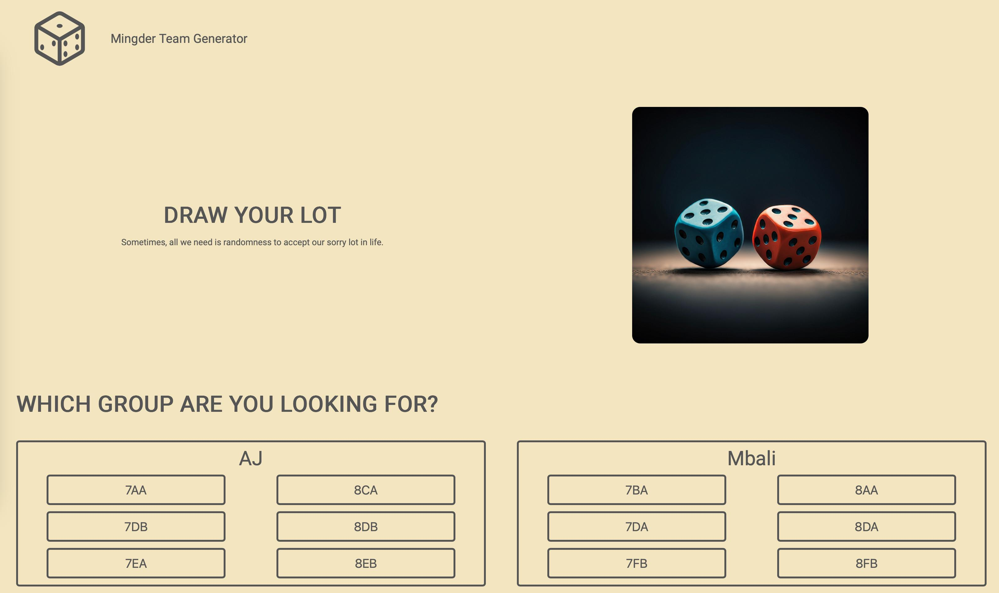

# Group Maker

A simple website to generate random groups in class.

## About the Project

### Preview

    

### Live

<a href='https://erreurdesyntaxe.github.io/group-maker/'>Group Maker</a>

### Objective

The goal of the project is to build a quick and easy way to make random groups
in class for presentations or teamwork.

### Notable Features

- Select a class (7AA, 7CB, 8DA, 8FB...)
- Select group size
- Visually group the students together
- Remove/Re-add student to the group making pool

## Built With

## To-Do

- [x] Understand the objectives
- [ ] Plan
  - [x] User stories
  - [x] Features
  - [x] Flowchart
  - [x] Architecture
  - [x] UI Design
  - [ ] Responsive Design
- [ ] Development
  - [x] Basic HTML
  - [x] Name Lists
    - [x] Teachers
    - [x] Teachers' Classes
  - [x] Console-Based Logic
  - [x] Remove Inidividual Students
  - [x] UI Features
    - [x] UI Sketch
    - [x] Overall Layout
    - [x] Individual Section Layout
  - [ ] Responsive Design
    - [ ] Media Queries
    - [ ] Mobile Menu
  - [ ] Check Accessibility
- [ ] Fix bugs
  - [ ] No bugs yet!

## User Stories

- As a teacher, I want to find the class I teach
- As a teacher, I want to choose the group size (from 2 to 4)
- As a teacher, I want 'extra' students to be groupe up with an existing group
- As a teacher, I want a visual representation of the groups
- As a teacher, I want to temporarily remove absentees from the process
- As a teacher, I want the absentee list to be reset at every lesson
- As a teacher, I want to go back if I missclicked

## Features

- Teachers select their "profile"
- Teachers can remove individual students from the group-making process
- Teachers can re-add students to the process
- Teachers can request a new shuffling of students

## Flowchart

Page Loads -> "Which teacher are you?" -> "Which class are you teaching?" ->
Possibility of removing/re-adding students -> Shuffle Button Pressed ->
Groups are randomly generated and displayed on screen

## Architecture

class Group {
-constructor(number, nameList) {
--this.number = number;
--this.nameList = nameList;
-}
}

class Teacher {
-constructor(name, groups) {
--this.name = name;
--this.groups = groups;
-}
}

class App {  
-constructor() {  
--this.init();  
-}  
-init() {
-}  
}

## Lessons & Difficulties

Some lessons learned along the way

## Diary

Some thoughts regarding the project
